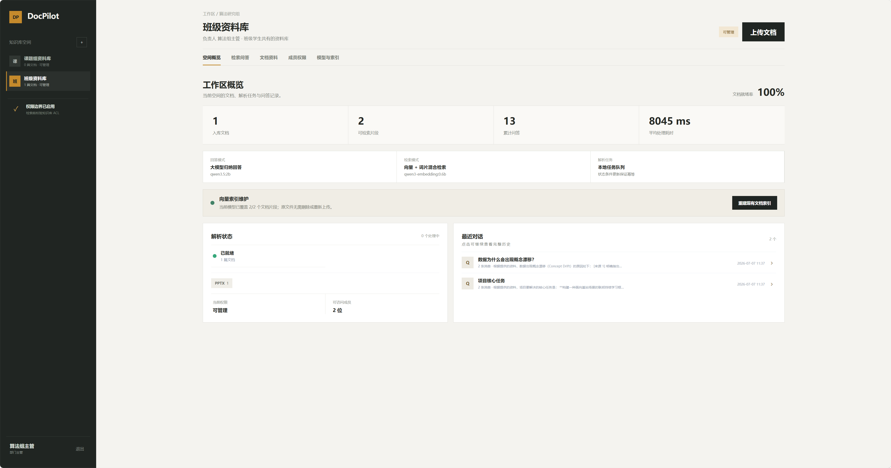
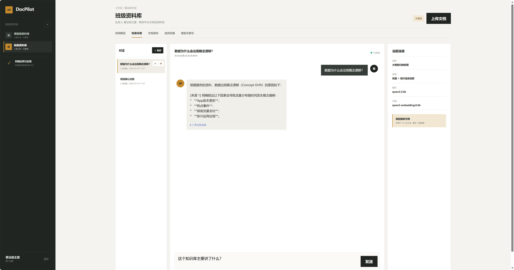
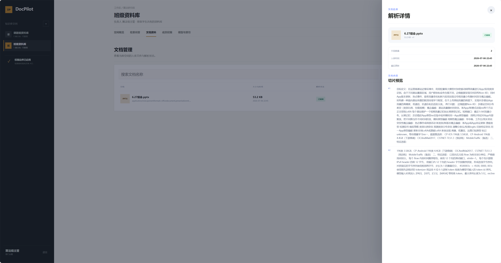
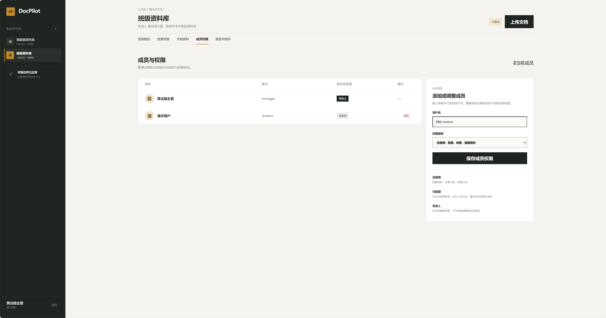
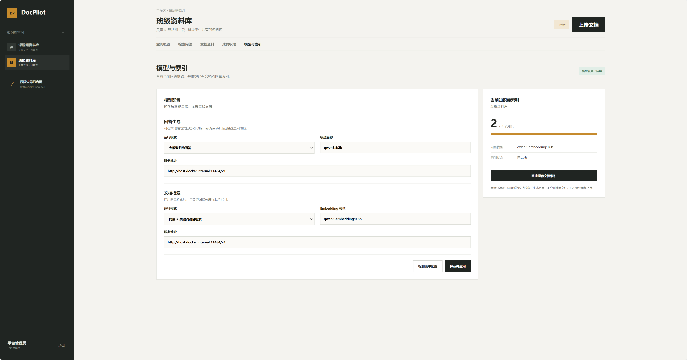
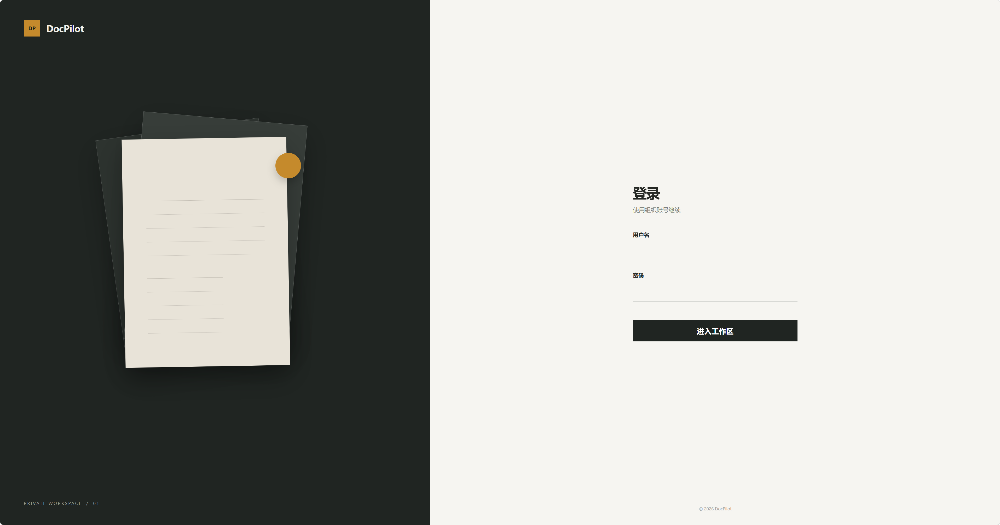

# DocPilot - 私有化知识库 Agent 平台

> 文档 RAG / LangChain-LangGraph Agent / 工具调用 / 人工审批 / 固定 RAG 降级

DocPilot 是一个面向课题组和部门内部资料的私有化知识库 Agent 平台，覆盖知识空间、文档上传、异步解析、成员授权、混合检索、引用追溯、工具调用和人工审批。系统保留原 Spring Boot 固定 RAG 链路，并新增独立 FastAPI Agent 服务，使模型能够在权限范围内自主选择知识库检索、文档诊断与恢复工具。

项目重点处理文档问答系统中的四类工程问题：文件解析属于耗时任务，不能长期占用上传接口；检索必须在权限边界内完成，不能先泄露片段再过滤；本地模型吞吐有限，需要限流和并发隔离；Embedding 或回答模型不可用时，系统仍应保留可运行的本地检索路径。

## 项目预览

启动后访问：<http://localhost:15174>

| 角色 | 账号 | 权限 |
| --- | --- | --- |
| 普通成员 | `student / 123456` | 使用被授权的知识库 |
| 部门主管 | `manager / 123456` | 管理本部门知识库、文档和成员 |
| 平台管理员 | `admin / 123456` | 管理全部空间和全局模型配置 |

### 知识空间概览



### 检索问答与引用



### 文档解析与切片



### 成员权限管理



### 模型与索引配置



### 登录页



## 核心功能

### 1. 私有知识空间与分级授权

- 平台管理员、部门主管和普通成员使用同一套 JWT 认证体系。
- 部门主管自动管理本部门知识库；普通成员只有被加入 ACL 后才能访问。
- 知识库权限进一步区分 `READ` 与 `MANAGE`：前者用于查看、检索和问答，后者可上传文档、重试任务和维护成员。
- 权限校验发生在文档查询和检索之前，未经授权的知识库 ID 不会进入召回流程或模型上下文。

### 2. MinIO 文件存储与异步解析

- 支持 PDF、Word、TXT、Markdown、PPT 和 Excel，单文件最大 100 MB。
- 原始文件保存在 MinIO；MySQL 保存文档元数据、解析状态、切片和索引信息。
- 文档记录与 `outbox_message` 在同一个数据库事务中提交，上传接口不等待 Tika 完成解析。
- Outbox 投递器每 2 秒领取任务，支持本地线程池和 RocketMQ 两种发布适配器；失败任务最多重试 5 次，并按指数退避延后执行。
- 解析消费者通过 `PENDING/FAILED → PROCESSING` 条件更新领取文档，重复消息无法再次处理已经完成的任务。

### 3. 文本抽取、语义切片与向量索引

- PDF 使用 PDFBox 逐页抽取并保留真实页码；文本过少的页面自动以 200 DPI 渲染，再调用 Tesseract `chi_sim+eng` OCR。Word、PPT、Excel、TXT 和 Markdown 等格式仍由 Apache Tika 统一抽取。
- 切片器先识别标题、段落和句子边界，再按默认 480 Token 预算组块并保留约 60 Token 重叠；PDF 切片禁止跨页，避免引用页码失真。这里使用轻量 Token 估算器控制预算，不声称与任一模型分词器逐 Token 完全一致。
- MySQL 保存正文切片、标题、页码、Token 数与词项倒排索引；向量写入独立 PostgreSQL + pgvector，并通过 HNSW 余弦索引召回，不再逐行解析 MySQL JSON。
- 文档分别记录正文解析状态与 Embedding 状态。向量生成不完整时删除该文档的残缺向量并标记 `PARTIAL/FAILED`，文本与 BM25 仍可使用；完整重建期间使用 `REINDEXING`，不会把失败误报为 `SUCCESS`。
- 每次重新解析先写入新的文档修订和影子向量集，只有文本、词法索引与向量集完整后才原子发布 `active_revision`；失败修订保留诊断信息，上一版正文继续可检索。默认保留最近 3 个修订，清理任务永不删除活动版或处理中修订。
- 向量记录绑定模型名称与固定维度；切换 Embedding 模型后旧模型向量不会参与新查询。

### 4. 全库 BM25、pgvector 与有阈值混合召回

- 中文二元词项和英文单词在入库时写入倒排表；BM25 的文档频率、平均长度和候选统计基于当前知识库全部可用切片，不再只统计“前 500 条候选”。历史切片由启动回填任务补齐词项与 Token 数。
- 向量通道使用 pgvector HNSW 召回，词法与向量得分默认按 `0.35 / 0.65` 融合；Embedding 服务不可用时自动退回全库 BM25。
- 排序后先执行相关性门禁，再截取 TopK：默认总分阈值 `0.20`、词法通道阈值 `0.05`、纯向量通道阈值 `0.45`。候选必须至少通过一个通道门槛和总分门槛，因此小语料库中的“最近但仍不相关”向量不会被强制返回。
- 默认只对已通过相关性门禁的前 24 个候选执行可解释二阶段 Reranker，综合问题词项覆盖、标题/文件名覆盖、词项邻近度和短语命中；最终得分保留 `baseScore`、`rerankScore` 和通道分数，便于 Trace 定位。Reranker 只重排合格候选，不能把门槛以下的无关片段“救回来”。
- 内部检索支持 `LEXICAL / VECTOR / HYBRID / HYBRID_RERANK` 四种显式策略；`scripts/retrieval_ablation.py` 使用固定标注问题输出 Recall@K、MRR 与无答案准确率，避免只凭单个演示问题宣称重排有效。
- 无合格片段时检索返回空数组，Agent 输出明确的证据不足答复；有命中时保留文档、修订号、切片、PDF 页码和得分，回答中的 `[n]` 只能引用实际返回来源。

### 5. 运行时模型切换

- 平台管理员可以在工作台切换本地抽取式回答和 OpenAI 兼容模型回答。
- 支持发现 Windows Ollama 中的模型、检测未保存配置、修改回答模型与 Embedding 模型。
- 模型配置存入 MySQL，保存后立即生效；部门主管可以查看当前模式并维护自己知识库的向量索引。
- 当前本地验证组合为 `qwen3.5:2b` 与 `qwen3-embedding:0.6b`，也可接入其他 Ollama、vLLM 或 OpenAI 兼容服务。

### 6. 问答限流与推理并发隔离

- Redis Lua 以“用户 + 分钟”为维度原子计数，默认限制每个用户每分钟 12 次问答。
- Redisson `RPermitExpirableSemaphore` 将全局推理并发限制为 3 路，许可证 120 秒自动过期。
- 获取不到许可证时快速返回 `503`，避免请求无界堆积；Redis/Redisson 异常时使用进程内信号量作为降级保护。

### 7. SSE 流式回答与来源追溯

前端通过带 JWT 的 `fetch` POST 请求发起问答，后端使用 `SseEmitter` 发送 `status`、`sources`、`token` 和 `done` 事件。SSE 适合服务端单向输出文本片段，且比维护双向 WebSocket 会话更符合当前场景。

工作台同时记录提问人、命中来源数和处理耗时；普通用户只查看自己的问答记录，管理员可以查看管理范围内的记录。

### 8. 多会话与历史恢复

- 每个用户可以在同一个知识库下创建多个独立对话，问题、回答和引用来源持久化到 MySQL。
- 首次提问后根据问题自动生成会话标题，同时支持手动重命名和删除。
- 知识空间概览展示当前用户的最近对话，点击后恢复完整消息和引用，可以继续追问。
- 会话按照“用户 + 知识库”隔离；即使平台管理员知道其他人的会话 ID，也不能直接读取私人对话内容。

## 文档入库与问答流程图

```mermaid
%%{init: {"flowchart": {"htmlLabels": true, "nodeSpacing": 28, "rankSpacing": 36}, "themeVariables": {"fontSize": "14px"}}}%%
flowchart TB
  U0["一、文档入库链路"]:::section
  U0 --> U1["管理成员上传文档"]
  U1 --> U2["校验知识库<br/>MANAGE 权限"]
  U2 --> U3["原始文件写入 MinIO"]
  U3 --> U4["同一事务写入 document<br/>与 outbox_message"]
  U4 --> U5["上传接口返回<br/>PENDING 状态"]
  U5 --> U6["Outbox 投递器<br/>异步领取任务"]
  U6 --> U7{"任务发布模式"}
  U7 -->|本地| U8["受控线程池"]
  U7 -->|消息队列| U9["RocketMQ"]
  U8 --> U10["条件更新领取<br/>文档解析任务"]
  U9 --> U10
  U10 --> U11["PDFBox 逐页 / Tika<br/>必要时 Tesseract OCR"]
  U11 --> U12["标题与段落感知切片<br/>Token 预算和重叠"]
  U12 --> U13["MySQL 保存片段与<br/>全库 BM25 词项"]
  U13 --> U14{"是否启用<br/>Embedding"}
  U14 -->|是| U15["向量写入 pgvector<br/>HNSW 索引"]
  U14 -->|否或失败| U16["保留 BM25 可用<br/>标记准确索引状态"]

  U16 -.-> Q0["二、检索问答链路"]:::section
  U15 -.-> Q0
  Q0 --> Q1["选择知识库<br/>新建或打开对话"]
  Q1 --> Q2["先校验 READ / MANAGE<br/>再进入检索"]
  Q2 --> Q3["Redis Lua<br/>用户级限流"]
  Q3 --> Q4["Redisson 信号量<br/>限制推理并发"]
  Q4 --> Q5["BM25 + pgvector 混合检索<br/>通道阈值过滤后取 TopK"]
  Q5 --> Q6{"回答模式"}
  Q6 -->|本地| Q7["本地抽取式回答"]
  Q6 -->|模型| Q8["Ollama / OpenAI<br/>兼容模型"]
  Q7 --> Q9["通过 SSE 返回<br/>答案与引用"]
  Q8 --> Q9
  Q9 --> Q10["持久化问题、回答<br/>与引用来源"]
  Q10 --> Q11["更新最近对话<br/>与问答审计"]

  classDef section fill:#1f2521,color:#ffffff,stroke:#1f2521,font-weight:bold;
```



## 技术栈

| 层级 | 技术 |
| --- | --- |
| 后端 | Java 17、Spring Boot 3.5、Spring Security、Spring JDBC |
| 数据与缓存 | MySQL 8.0、PostgreSQL 17 + pgvector、Redis 7.2、Redisson 3.23 |
| 文档处理 | MinIO、Apache Tika 2.9、PDFBox、Tesseract OCR |
| 异步任务 | 本地消息表、受控线程池、可选 RocketMQ 4.9 |
| 模型与检索 | Ollama/OpenAI 兼容接口、全库 BM25、pgvector HNSW、SSE |
| Agent 编排 | Python 3.12、FastAPI、LangChain、LangGraph、ChatOllama |
| 前端 | Vue 3、Vite、Fetch ReadableStream |
| 部署 | Docker、Docker Compose、Nginx |

## 运行模式

| 模式 | 回答 | 检索 | 适用场景 |
| --- | --- | --- | --- |
| 默认模式 | 本地抽取式回答 | 关键词检索 | 无模型环境、快速验证工程闭环 |
| 本机 Ollama | 本地大模型 | Embedding + 关键词 | 已安装 Ollama，希望复用本机模型 |
| Compose AI | Ollama 容器 | Embedding + 关键词 | 希望模型与业务一起编排 |
| OpenAI 兼容服务 | 配置的远程模型 | 可独立配置 | vLLM 或云端兼容接口 |

## 项目结构

```text
docpilot/
├─ agent-service/                  FastAPI + LangChain/LangGraph Agent 服务
├─ client/                         Vue 3 前端
├─ server/                         Spring Boot 后端
├─ samples/课题组实验规范.md        可直接上传的演示文档
├─ rocketmq/broker.conf            RocketMQ Broker 配置
├─ docs/STARTUP.md                 启动与排错手册
├─ docs/api.http                   接口调试示例
├─ docker-compose.yml              默认编排
├─ docker-compose.smoke.yml        全新数据库迁移与启动冒烟验收
├─ docker-compose.agent.yml        Agent 服务增量配置
├─ docker-compose.rocketmq.yml     RocketMQ 增量配置
├─ docker-compose.ai.yml           Ollama 增量配置
├─ start.ps1                       默认模式启动
├─ start-local-ollama.ps1          复用 Windows Ollama
├─ start-ai.ps1                    启动 Ollama 容器与模型
├─ start-rocketmq.ps1              RocketMQ 模式启动
├─ .env.example                    环境变量模板
└─ LICENSE                         MIT License
```

## 开发环境

| 组件 | 建议版本 | 说明 |
| --- | --- | --- |
| JDK | 17 或更高 | Spring Boot 3.5 与 Jakarta API 基线 |
| Node.js | 20 | Vue 前端构建 |
| MySQL | 8.0 | 元数据、切片、ACL、Outbox、模型配置 |
| PostgreSQL + pgvector | 17 | 向量存储与 HNSW 近邻索引 |
| Redis | 7.2 | 限流与分布式推理许可证 |
| MinIO | 2024-11 | 原始文档对象存储 |
| Tesseract | 5.x | 扫描 PDF 的中英文 OCR；Compose 镜像已内置 |
| Docker Desktop | 当前稳定版 | 推荐的完整启动方式 |
| Ollama | 当前稳定版 | 可选，本地模型增强模式使用 |

## 快速启动

### 默认模式

```powershell
cd docpilot
.\start.ps1
```

### 复用 Windows 中已有的 Ollama

```powershell
ollama list
cd docpilot
.\start-local-ollama.ps1 -ChatModel "qwen3.5:2b" -EmbeddingModel "qwen3-embedding:0.6b"
```

### RocketMQ 解析模式

```powershell
cd docpilot
.\start-rocketmq.ps1
```

- 前端：<http://localhost:15174>
- 后端健康检查：<http://localhost:18081/actuator/health>
- MinIO 控制台：<http://localhost:19001>

首次运行可以上传 [samples/课题组实验规范.md](samples/课题组实验规范.md)。已有文档在切换 Embedding 模型后，进入“模型与索引”页面执行一次重建即可，无需重新上传。

完整启动步骤和常见问题见 [docs/STARTUP.md](docs/STARTUP.md)。

提交前可使用隔离的 tmpfs 数据库执行一次完整迁移与启动冒烟，不会复用或修改本地演示数据：

```powershell
docker compose -p docpilot-smoke -f docker-compose.smoke.yml up -d --build --wait --wait-timeout 240
docker compose -p docpilot-smoke -f docker-compose.smoke.yml down --remove-orphans
```

## 开源与部署安全

- 仓库只提交 `.env.example`；本地 `.env`、备份、上传文件、私钥和 IDE 配置已通过 `.gitignore` 排除。
- Compose 端口默认只绑定 `127.0.0.1`，用于本机演示；若部署到服务器，应先更换数据库、MinIO、JWT 与模型服务凭据，并删除演示账号初始化逻辑。
- 不要上传真实知识库文档、MinIO 数据目录、数据库卷或带有真实 API Key 的模型配置。

## 建议演示顺序

1. 使用主管账号上传演示文档，观察 `PENDING → PROCESSING → SUCCESS`。
2. 查看文档详情和真实切片内容。
3. 在成员页为普通用户授予 `READ`，再使用普通用户进入知识库。
4. 新建两个独立对话并分别提问，切换对话后恢复各自的历史消息与引用。
5. 从空间概览点击“最近对话”，直接返回历史并继续追问。
6. 使用管理员进入“模型与索引”，展示模型发现、连接检测、模式切换和索引覆盖率。
7. 快速连续提问，展示用户限流和推理并发保护。

## LangChain / LangGraph Agent 模式

Agent 模式是可选的 Compose 覆盖层，原有固定 RAG 路径仍可独立运行，并在 Agent 服务异常时作为降级路径。

```powershell
docker compose -f docker-compose.yml -f docker-compose.agent.yml up -d --build
```

Agent 服务使用 LangChain 工具与 ChatOllama，并以显式 LangGraph 组织两条主路径：知识问答执行
`route_intent → plan_required_retrieval → execute_tools → verify_result → call_model → guard_answer`；
文档运维执行 `route_intent → plan_document_operation → execute_tools → advance_document_operation → policy_gate`。
知识型问题会被确定性规划为先检索，模型不能跳过证据获取；无证据直接拒答，缺失引用可在不新增事实、且引用序号不越界的前提下做一次修复。若模型回答仍夹带未引用结论，系统只在问题与来源原句达到严格词面匹配阈值时返回一条逐字抽取并带引用的原句，否则继续安全拒答。文档恢复固定执行“列出候选 → 逐项诊断 → 校验 FAILED/PARTIAL → 为单个文档生成写动作 → HITL → 校验入队响应 → 继续下一项 → 汇总”，不把关键状态迁移交给模型猜测。批量恢复最多处理 5 个候选，每个文档都有独立审批，可在任意一次审批处跨进程中断/恢复；拒绝或单项失败会记入计划结果，不会绕过审批，也不会抹掉已经完成的步骤。
LangGraph checkpoint 以对话 ID 维持完整审计状态，开发环境可用 SQLite，Compose 默认使用 PostgreSQL；模型输入另外采用分层上下文记忆：默认按 6000 Token 估算预算保留最近的完整轮次，较早轮次增量压缩为脱敏摘要并继续写回 checkpoint。摘要只帮助保持会话连续性，不能替代当前检索证据；Trace 会记录本次选取、压缩和预算信息。预算控制使用轻量估算器，部署到特定模型后应按其 tokenizer 校准。
`retry_document_parsing` 在 `policy_gate` 中断；待审批动作同时写入 Java 业务库，容器重启后仍可查询并以相同 `thread_id` 恢复。
Java 内部网关仍负责用户映射、ACL、`FAILED → PENDING` 条件更新、Outbox 入队和重复任务防护，
模型无权绕开这些校验。

Agent 服务就绪检查：<http://localhost:18090/health/ready>；指标：<http://localhost:18090/metrics>。

### Agent 服务边界

| 层级 | 主要职责 |
| --- | --- |
| Vue 前端 | 展示模型 Token、工具状态、引用来源和待审批动作 |
| Spring Boot | 统一 JWT 入口、会话落库、知识库 ACL、Agent 事件转发和固定 RAG 降级 |
| FastAPI Agent | 执行意图路由、检索计划、模型调用、工具策略、结果验证与引用守卫 |
| LangGraph | 显式状态图；按用户和 `thread_id` 保存 checkpoint，支持中断、恢复与多步骤状态管理 |
| DocPilot 文档工具网关 | 执行检索、状态诊断和重解析写操作，继续承担权限、事务、条件更新与 Outbox 幂等 |

### 已注册工具

| 工具类型 | 工具 | 执行规则 |
| --- | --- | --- |
| 知识库 | `search_knowledge_base`、`get_chunk_source`、`list_accessible_knowledge_bases` | 检索前由 Java 侧执行 ACL 校验 |
| 文档诊断 | `list_documents`、`get_document_diagnostics` | 读取文档状态、失败原因、版本和切片数，不产生业务副作用 |
| 文档恢复 | `retry_document_parsing` | 仅允许管理者重试 `FAILED` 文档；先触发 HITL，批准后再条件更新并写入 Outbox |

### 状态、审批与流式事件

- Java 将 `conversationId` 映射为稳定 `thread_id`；本地可使用 SQLite checkpoint，Compose 默认使用 PostgreSQL checkpoint，使中断审批状态可跨 Agent 容器重启恢复。
- `ToolRuntime` 上下文携带 `username`、`user_id`、`role`、`kb_id` 和 `thread_id`；这些字段不作为可由模型填写的普通工具参数暴露。
- 写工具由 `policy_gate` 暂停；Java 将审批 ID、用户、会话、知识库、线程、工具、资源、参数快照和过期时间持久化。批准令牌使用 HMAC 绑定动作且仅可消费一次，最终写入仍再次校验 ACL、文档状态并与 Outbox 事务提交。
- Python 以 NDJSON 输出 `status`、`token`、`replace`、`sources`、`approval`、`done` 与 `error` 事件，Java 再转换成浏览器原有 SSE 协议。
- 普通问答在 Agent 连接失败、超时或执行异常时回退固定 RAG；审批恢复依赖 checkpoint，不进行无状态重放。
- Java 调用 Agent 服务时使用独立服务密钥；单次运行限制模型与工具调用次数，防止循环失控。
- 内部工具网关对安全读取执行指数退避重试，并以连续失败熔断保护下游服务；重解析写操作不做网络层自动重放，由 Java `FAILED → PENDING` 条件更新防止重复领取。
- Agent→Java 内部工具接口采用“内部服务密钥 + 短时 HMAC 用户身份”双重校验：令牌绑定 `iss/aud/kid/jti/sub/iat/nbf/exp`，Java 验签、校验时窗并重新查询启用用户与 ACL，不信任可伪造的用户名请求头。可选接入 AgentOps Hub 上报 Trace、模型 Span 与工具 Span；流式响应通过请求级 `ContextVar` 上下文推进 LangGraph，避免跨线程/分段 `yield` 后丢失 Span，也不会用全局状态串扰并发请求。生产模式使用与 AgentOps `IDENTITY_TOKEN_SECRET` 对应的 `AGENTOPS_IDENTITY_TOKEN_SECRET`，为每次请求生成 5 分钟服务身份令牌，避免把会过期的静态令牌长期写入环境变量。`/v1/agent/evaluate` 提供回归评测所需的结构化结果，观测平台异常不会阻断业务回答。

## 学习阶段前的四项基线

[`docs/READINESS_BASELINE.md`](docs/READINESS_BASELINE.md) 固化了当前已验证能力、真实依赖验收和轻量并发基线。建议在系统 E2E 运行时执行：

```powershell
.\scripts\run_acceptance_matrix.ps1
.\scripts\run_light_load.ps1 -BaseUrl http://127.0.0.1:28081
```

真实依赖验收会临时启用 RocketMQ、pgvector、Tesseract OCR 和 Ollama Embedding；稳定系统 E2E 则继续保持本地队列、关闭向量和 OCR，以保证回归可重复。两种结果不能混写。

## 验收口径与当前边界

- **检索正确性**：相关问题必须返回可核验来源；全不相关问题必须零召回并安全拒答；PDF 来源必须带真实页码，扫描页必须经过 OCR 后才可索引。
- **索引一致性**：正文抽取、词法索引和向量索引状态分别可见；Embedding 失败不得标记完整成功，也不得留下可搜索的半套向量。
- **Agent 可恢复性**：写操作必须先中断并持久化审批，重启后仍可恢复；令牌必须绑定用户、线程、工具和参数且只能消费一次。
- **评测闭环**：每次 Agent 运行上报 Trace/Span；AgentOps 使用 160 条分层版本化用例（48 条人工核心 + 112 条矩阵变体）、重复运行、确定性多维评分与可选语义 Judge 做回归，失败证据可由 EvalOps 诊断并经 HITL 加入回归集或发起新评测。

- 当前上下文预算使用轻量估算器，不是特定模型的精确 tokenizer；需要严格上下文计费时可替换成与部署模型一致的 tokenizer。完整对话仍保留在 checkpoint，摘要仅是模型窗口的压缩视图。
- Tesseract 适合中英文印刷体扫描件；复杂表格、手写体和低清图片仍需要版面分析/OCR 服务与人工抽样复核。
- Outbox 采用数据库轮询，每批最多领取 32 条并逐条条件更新抢占；大规模任务下仍需要分区、按库限流或专用 CDC 方案。
- 默认演示账号、数据库密码和 MinIO 密钥不能直接用于公网环境。
- 项目未进行正式生产压测，因此不声明 QPS、P95 或错误率指标。
- `qwen3.5:2b` 适合本机链路验证，但小模型的工具选择稳定性有限；面试演示前应使用测试集验证工具选择、参数正确率、引用命中率和写操作审批覆盖率。

## License

本项目使用 [MIT License](LICENSE)。
