# DocPilot - 私有化知识库 Agent 平台

> 文档 RAG / LangChain-LangGraph Agent / 工具调用 / 人工审批 / 固定 RAG 降级

DocPilot 是一个面向课题组和部门内部资料的私有化知识库 Agent 平台，覆盖知识空间、文档上传、异步解析、成员授权、混合检索、引用追溯、工具调用和人工审批。系统保留原 Spring Boot 固定 RAG 链路，并新增独立 FastAPI Agent 服务，使模型能够在权限范围内选择知识库与研约工具。

项目重点处理文档问答系统中的四类工程问题：文件解析属于耗时任务，不能长期占用上传接口；检索必须在权限边界内完成，不能先泄露片段再过滤；本地模型吞吐有限，需要限流和并发隔离；Embedding 或回答模型不可用时，系统仍应保留可运行的本地检索路径。

## 项目预览

启动后访问：<http://localhost:15174>

| 角色 | 账号 | 权限 |
| --- | --- | --- |
| 普通成员 | `student / 123456` | 使用被授权的知识库 |
| 部门主管 | `manager / 123456` | 管理本部门知识库、文档和成员 |
| 平台管理员 | `admin / 123456` | 管理全部空间和全局模型配置 |

### 知识空间概览


### 检索问答与引用


### 文档解析与切片


### 成员权限管理


### 模型与索引配置


### 登录页


## 核心功能

### 1. 私有知识空间与分级授权

- 平台管理员、部门主管和普通成员使用同一套 JWT 认证体系。
- 部门主管自动管理本部门知识库；普通成员只有被加入 ACL 后才能访问。
- 知识库权限进一步区分 `READ` 与 `MANAGE`：前者用于查看、检索和问答，后者可上传文档、重试任务和维护成员。
- 权限校验发生在文档查询和检索之前，未经授权的知识库 ID 不会进入召回流程或模型上下文。

### 2. MinIO 文件存储与异步解析

- 支持 PDF、Word、TXT、Markdown、PPT 和 Excel，单文件最大 100 MB。
- 原始文件保存在 MinIO；MySQL 保存文档元数据、解析状态、切片和索引信息。
- 文档记录与 `outbox_message` 在同一个数据库事务中提交，上传接口不等待 Tika 完成解析。
- Outbox 投递器每 2 秒领取任务，支持本地线程池和 RocketMQ 两种发布适配器；失败任务最多重试 5 次，并按指数退避延后执行。
- 解析消费者通过 `PENDING/FAILED → PROCESSING` 条件更新领取文档，重复消息无法再次处理已经完成的任务。

### 3. 文本抽取、切片与向量索引

- Apache Tika 统一抽取多种格式文本；扫描版 PDF 没有文本层时给出明确提示。
- 文本按约 700 字符切片，并保留 100 字符重叠，降低段落边界截断造成的信息损失。
- 启用 Embedding 后自动为新文档生成向量；已有文档可以直接重建索引，无需删除或重新上传。
- 向量记录保存模型名称，切换 Embedding 模型后旧向量不会参与新模型检索，避免不同维度向量混用。

### 4. 关键词检索与混合召回

默认模式使用字符和二元词片相关度完成本地召回，不依赖外部模型。启用向量模式后，使用“75% 余弦相似度 + 25% 词片相关度”进行混合排序，并选取 TopK 片段作为回答上下文。

当 Embedding 服务临时不可用时，检索层记录异常并回退关键词召回；每条命中结果保留文档名、原始片段和相关度，用于前端引用核验。

### 5. 运行时模型切换

- 平台管理员可以在工作台切换本地抽取式回答和 OpenAI 兼容模型回答。
- 支持发现 Windows Ollama 中的模型、检测未保存配置、修改回答模型与 Embedding 模型。
- 模型配置存入 MySQL，保存后立即生效；部门主管可以查看当前模式并维护自己知识库的向量索引。
- 当前本地验证组合为 `qwen3.5:2b` 与 `qwen3-embedding:0.6b`，也可接入其他 Ollama、vLLM 或 OpenAI 兼容服务。

### 6. 问答限流与推理并发隔离

- Redis Lua 以“用户 + 分钟”为维度原子计数，默认限制每个用户每分钟 12 次问答。
- Redisson `RPermitExpirableSemaphore` 将全局推理并发限制为 3 路，许可证 120 秒自动过期。
- 获取不到许可证时快速返回 `503`，避免请求无界堆积；Redis/Redisson 异常时使用进程内信号量作为降级保护。

### 7. SSE 流式回答与来源追溯

前端通过带 JWT 的 `fetch` POST 请求发起问答，后端使用 `SseEmitter` 发送 `status`、`sources`、`token` 和 `done` 事件。SSE 适合服务端单向输出文本片段，且比维护双向 WebSocket 会话更符合当前场景。

工作台同时记录提问人、命中来源数和处理耗时；普通用户只查看自己的问答记录，管理员可以查看管理范围内的记录。

### 8. 多会话与历史恢复

- 每个用户可以在同一个知识库下创建多个独立对话，问题、回答和引用来源持久化到 MySQL。
- 首次提问后根据问题自动生成会话标题，同时支持手动重命名和删除。
- 知识空间概览展示当前用户的最近对话，点击后恢复完整消息和引用，可以继续追问。
- 会话按照“用户 + 知识库”隔离；即使平台管理员知道其他人的会话 ID，也不能直接读取私人对话内容。

## 文档入库与问答流程图

```mermaid
%%{init: {"flowchart": {"htmlLabels": true, "nodeSpacing": 28, "rankSpacing": 36}, "themeVariables": {"fontSize": "14px"}}}%%
flowchart TB
  U0["一、文档入库链路"]:::section
  U0 --> U1["管理成员上传文档"]
  U1 --> U2["校验知识库<br/>MANAGE 权限"]
  U2 --> U3["原始文件写入 MinIO"]
  U3 --> U4["同一事务写入 document<br/>与 outbox_message"]
  U4 --> U5["上传接口返回<br/>PENDING 状态"]
  U5 --> U6["Outbox 投递器<br/>异步领取任务"]
  U6 --> U7{"任务发布模式"}
  U7 -->|本地| U8["受控线程池"]
  U7 -->|消息队列| U9["RocketMQ"]
  U8 --> U10["条件更新领取<br/>文档解析任务"]
  U9 --> U10
  U10 --> U11["Apache Tika<br/>抽取文档文本"]
  U11 --> U12["按 700 字符切片<br/>保留 100 字符重叠"]
  U12 --> U13["MySQL 保存<br/>文档片段"]
  U13 --> U14{"是否启用<br/>Embedding"}
  U14 -->|是| U15["生成向量并保存<br/>对应模型名称"]
  U14 -->|否| U16["使用关键词<br/>检索模式"]

  U16 -.-> Q0["二、检索问答链路"]:::section
  U15 -.-> Q0
  Q0 --> Q1["选择知识库<br/>新建或打开对话"]
  Q1 --> Q2["先校验 READ / MANAGE<br/>再进入检索"]
  Q2 --> Q3["Redis Lua<br/>用户级限流"]
  Q3 --> Q4["Redisson 信号量<br/>限制推理并发"]
  Q4 --> Q5["关键词或向量混合检索<br/>召回 TopK 片段"]
  Q5 --> Q6{"回答模式"}
  Q6 -->|本地| Q7["本地抽取式回答"]
  Q6 -->|模型| Q8["Ollama / OpenAI<br/>兼容模型"]
  Q7 --> Q9["通过 SSE 返回<br/>答案与引用"]
  Q8 --> Q9
  Q9 --> Q10["持久化问题、回答<br/>与引用来源"]
  Q10 --> Q11["更新最近对话<br/>与问答审计"]

  classDef section fill:#1f2521,color:#ffffff,stroke:#1f2521,font-weight:bold;
```



## 技术栈

| 层级 | 技术 |
| --- | --- |
| 后端 | Java 8、Spring Boot 2.7、Spring Security、Spring JDBC |
| 数据与缓存 | MySQL 8.0、Redis 7.2、Redisson 3.23 |
| 文档处理 | MinIO、Apache Tika 2.9 |
| 异步任务 | 本地消息表、受控线程池、可选 RocketMQ 4.9 |
| 模型与检索 | Ollama/OpenAI 兼容接口、混合检索、SSE |
| Agent 编排 | Python 3.12、FastAPI、LangChain、LangGraph、ChatOllama |
| 前端 | Vue 3、Vite、Fetch ReadableStream |
| 部署 | Docker、Docker Compose、Nginx |

## 运行模式

| 模式 | 回答 | 检索 | 适用场景 |
| --- | --- | --- | --- |
| 默认模式 | 本地抽取式回答 | 关键词检索 | 无模型环境、快速验证工程闭环 |
| 本机 Ollama | 本地大模型 | Embedding + 关键词 | 已安装 Ollama，希望复用本机模型 |
| Compose AI | Ollama 容器 | Embedding + 关键词 | 希望模型与业务一起编排 |
| OpenAI 兼容服务 | 配置的远程模型 | 可独立配置 | vLLM 或云端兼容接口 |

## 项目结构

```text
docpilot/
├─ agent-service/                  FastAPI + LangChain/LangGraph Agent 服务
├─ client/                         Vue 3 前端
├─ server/                         Spring Boot 后端
├─ samples/课题组实验规范.md        可直接上传的演示文档
├─ rocketmq/broker.conf            RocketMQ Broker 配置
├─ docs/STARTUP.md                 启动与排错手册
├─ docs/api.http                   接口调试示例
├─ docker-compose.yml              默认编排
├─ docker-compose.agent.yml        Agent 服务增量配置
├─ docker-compose.rocketmq.yml     RocketMQ 增量配置
├─ docker-compose.ai.yml           Ollama 增量配置
├─ start.ps1                       默认模式启动
├─ start-local-ollama.ps1          复用 Windows Ollama
├─ start-ai.ps1                    启动 Ollama 容器与模型
├─ start-rocketmq.ps1              RocketMQ 模式启动
├─ .env.example                    环境变量模板
└─ LICENSE                         MIT License
```

## 开发环境

| 组件 | 建议版本 | 说明 |
| --- | --- | --- |
| JDK | 8 或更高 | 容器构建使用 JDK 17，源码兼容 Java 8 |
| Node.js | 20 | Vue 前端构建 |
| MySQL | 8.0 | 元数据、切片、ACL、Outbox、模型配置 |
| Redis | 7.2 | 限流与分布式推理许可证 |
| MinIO | 2024-11 | 原始文档对象存储 |
| Docker Desktop | 当前稳定版 | 推荐的完整启动方式 |
| Ollama | 当前稳定版 | 可选，本地模型增强模式使用 |

## 快速启动

### 默认模式

```powershell
cd docpilot
.\start.ps1
```

### 复用 Windows 中已有的 Ollama

```powershell
ollama list
cd docpilot
.\start-local-ollama.ps1 -ChatModel "qwen3.5:2b" -EmbeddingModel "qwen3-embedding:0.6b"
```

### RocketMQ 解析模式

```powershell
cd docpilot
.\start-rocketmq.ps1
```

- 前端：<http://localhost:15174>
- 后端健康检查：<http://localhost:18081/actuator/health>
- MinIO 控制台：<http://localhost:19001>

首次运行可以上传 [samples/课题组实验规范.md](samples/课题组实验规范.md)。已有文档在切换 Embedding 模型后，进入“模型与索引”页面执行一次重建即可，无需重新上传。

完整启动步骤和常见问题见 [docs/STARTUP.md](docs/STARTUP.md)。

## 开源与部署安全

- 仓库只提交 `.env.example`；本地 `.env`、备份、上传文件、私钥和 IDE 配置已通过 `.gitignore` 排除。
- Compose 端口默认只绑定 `127.0.0.1`，用于本机演示；若部署到服务器，应先更换数据库、MinIO、JWT 与模型服务凭据，并删除演示账号初始化逻辑。
- 不要上传真实知识库文档、MinIO 数据目录、数据库卷或带有真实 API Key 的模型配置。

## 建议演示顺序

1. 使用主管账号上传演示文档，观察 `PENDING → PROCESSING → SUCCESS`。
2. 查看文档详情和真实切片内容。
3. 在成员页为普通用户授予 `READ`，再使用普通用户进入知识库。
4. 新建两个独立对话并分别提问，切换对话后恢复各自的历史消息与引用。
5. 从空间概览点击“最近对话”，直接返回历史并继续追问。
6. 使用管理员进入“模型与索引”，展示模型发现、连接检测、模式切换和索引覆盖率。
7. 快速连续提问，展示用户限流和推理并发保护。

## LangChain / LangGraph Agent 模式

Agent 模式是可选的 Compose 覆盖层，原有固定 RAG 路径仍可独立运行，并在 Agent 服务异常时作为降级路径。

```powershell
# 先启动研约，使业务工具可用；两个项目的 YANYUE_AGENT_KEY 必须一致
cd yanyue
docker compose up -d --build

cd ..\docpilot
docker compose -f docker-compose.yml -f docker-compose.agent.yml up -d --build
```

Agent 服务使用 LangChain `create_agent` 和 ChatOllama，将知识库检索、片段溯源、可访问知识库、
实验室资源查询和预约操作封装为工具；LangGraph checkpoint 以对话 ID 维持状态，开发环境可用 SQLite，
生产化 Compose 默认使用 PostgreSQL。预约、取消、
签到由 `HumanInTheLoopMiddleware` 在工具执行前中断，前端批准或拒绝后才使用相同 `thread_id`
恢复执行。Java 内部网关仍负责用户映射、ACL、事务、唯一约束和幂等，模型无权绕开这些校验。

Agent 服务就绪检查：<http://localhost:18090/health/ready>；指标：<http://localhost:18090/metrics>。

### Agent 服务边界

| 层级 | 主要职责 |
| --- | --- |
| Vue 前端 | 展示模型 Token、工具状态、引用来源和待审批动作 |
| Spring Boot | 统一 JWT 入口、会话落库、知识库 ACL、Agent 事件转发和固定 RAG 降级 |
| FastAPI Agent | 使用 `create_agent` 组织模型、Prompt、工具、运行上下文和中间件 |
| LangGraph | 按 `thread_id` 保存 checkpoint，支持中断、恢复与多步骤状态管理 |
| DocPilot/研约工具网关 | 执行真实查询和写操作，继续承担权限、事务、唯一约束与幂等 |

### 已注册工具

| 工具类型 | 工具 | 执行规则 |
| --- | --- | --- |
| 知识库 | `search_knowledge_base`、`get_chunk_source`、`list_accessible_knowledge_bases` | 检索前由 Java 侧执行 ACL 校验 |
| 研约只读 | `list_lab_resources`、`query_resource_availability`、`list_my_reservations` | 可直接执行，不产生业务副作用 |
| 研约写入 | `create_reservation`、`cancel_reservation`、`check_in_reservation` | 先触发 HITL，批准后才调用研约 |

### 状态、审批与流式事件

- Java 将 `conversationId` 映射为稳定 `thread_id`；本地可使用 SQLite checkpoint，Compose 默认使用 PostgreSQL checkpoint，使中断审批状态可跨 Agent 容器重启恢复。
- `ToolRuntime` 上下文携带 `username`、`user_id`、`role`、`kb_id` 和 `thread_id`；这些字段不作为可由模型填写的普通工具参数暴露。
- 写工具由 `HumanInTheLoopMiddleware` 暂停，前端批准或拒绝后通过相同 `thread_id` 恢复；研约网关还会再次检查 `X-Agent-Approval`。
- Python 以 NDJSON 输出 `status`、`token`、`replace`、`sources`、`approval`、`done` 与 `error` 事件，Java 再转换成浏览器原有 SSE 协议。
- 普通问答在 Agent 连接失败、超时或执行异常时回退固定 RAG；审批恢复依赖 checkpoint，不进行无状态重放。
- Java 调用 Agent 服务时使用独立服务密钥；单次运行限制模型与工具调用次数，防止循环失控。
- 内部工具网关对安全读取和带 `requestId` 的幂等写入执行指数退避重试，并以连续失败熔断保护下游服务。
- 可选接入 AgentOps Hub 上报 Trace/Tool Span；`/v1/agent/evaluate` 提供回归评测所需的结构化结果，观测平台异常不会阻断业务回答。

## 当前边界

- Apache Tika 不提供 OCR，纯扫描 PDF 需要预先识别或额外接入 OCR 服务。
- 当前向量存储采用 MySQL JSON 文本，适合项目演示和小规模知识库；更大数据量可迁移到 pgvector、Milvus 或 Elasticsearch。
- Outbox 采用数据库轮询，每次领取一条消息；大规模任务下需要批量领取、分区或专用 CDC 方案。
- 默认演示账号、数据库密码和 MinIO 密钥不能直接用于公网环境。
- 项目未进行正式生产压测，因此不声明 QPS、P95 或错误率指标。
- `qwen3.5:2b` 适合本机链路验证，但小模型的工具选择稳定性有限；面试演示前应使用测试集验证工具选择、参数正确率、引用命中率和写操作审批覆盖率。

## License

本项目使用 [MIT License](LICENSE)。
